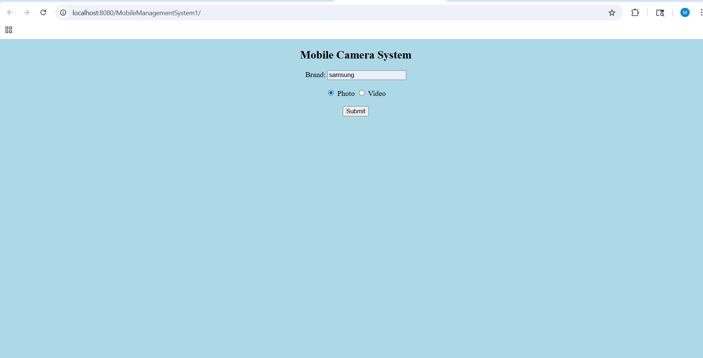
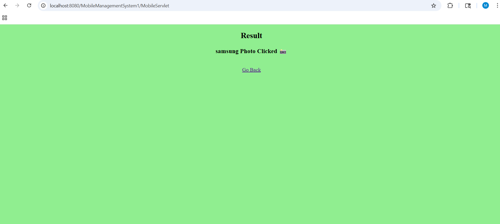

# Implement Interface Camera

## Project Overview
This project is a Java-based web application developed using Eclipse, Servlets, and JSP.  
The application demonstrates the implementation of interfaces in Java through a simple mobile and camera management system.

The project is designed to show:

- Object-Oriented Programming concepts
- Interface implementation
- Java Servlet handling
- JSP page interaction
- Basic web application structure using Apache Tomcat

---

## Technologies Used

- Java
- JSP (Java Server Pages)
- Servlets
- Apache Tomcat 9.0
- Eclipse IDE
- HTML/CSS

---

## Project Structure

```text
src/main/java/mobilemanagement
    ├── Camera.java
    ├── Mobile.java
    └── MobileServlet.java

src/main/webapp
    ├── index.jsp
    └── result.jsp
```

---

## Features

- Camera interface implementation
- Mobile class integration
- User input handling using JSP
- Servlet-based processing
- Result display using JSP pages
- Simple and clean project structure

---

## How to Run the Project

1. Import the project into Eclipse.
2. Configure Apache Tomcat Server.
3. Add the project to the server.
4. Run the server.
5. Open browser and access:

```text
http://localhost:8080/MobileManagementSystem1/
```

---

## Output Screenshots

### Home Page



### Result Page



---

## Learning Outcomes

- Understanding Java Interfaces
- Working with Servlets and JSP
- Web application deployment using Tomcat
- Handling client-server interaction
- Java package management

---

## Author

Developed as an academic project submission.
